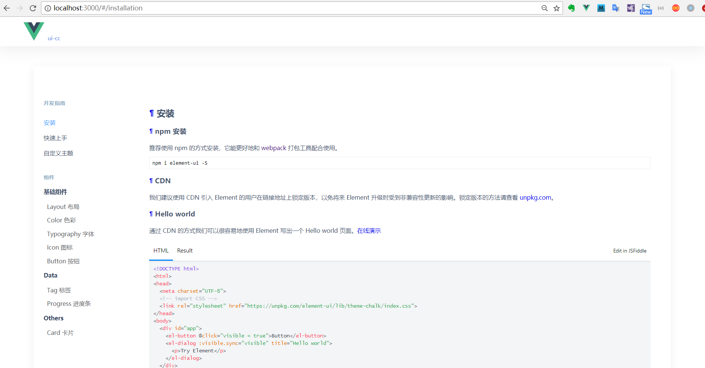

# ui-cc

> 仿造elementUI，制作自己的UI框架(全部引入与按需加载)

## Build Setup

``` bash
# 下载依赖
npm install

# 运行测试项目
npm run dev

# 打包插件，生成lib文件夹
npm run build:theme  // 打包字体文件与样式
npm run build:lib    // 打包所有组件生成index.js，与对应的单个组件

# 打包测试项目静态资源文件，生成dist文件夹
npm run build
```
## 目录
- [**1-初步构建**](#1-初步构建)
- [**2-修改配置**](#2-修改配置)
- [**3-编写组件**](#3-编写组件)
- [**4-打包组件，package.json修改**](#4-打包组件，package.json修改)
- [**5-打包css和fonts**](#5-打包css和fonts)
- [**6-测试**](#6-测试)
- [**7-按需加载**](#7-按需加载)
- [**8-UI框架Markdown格式组件说明文档**](#8-UI框架Markdown格式组件说明文档)
  - [8.1 下载依赖](#81-下载依赖)
  - [8.2 配置](#82-配置)
  - [8.3 md格式组件使用](#83-md格式组件使用)
- [**9-项目目录**](#9-项目目录)

## <a id="1-初步构建"></a>1-初步构建

建立一个vue-cli多页面项目： [https://github.com/ccyinghua/webpack-multipage](https://github.com/ccyinghua/webpack-multipage)

- 将src文件夹重命名为examples，作为调试、UI框架说明文档例子
- 将build目录下的webpack相关配置文件中关于src的路径改为examples,修改部分如下：
```javascript
// webpack.base.conf.js
module.exports = {
  entry: utils.getEntries('./examples/entry/*/*.js'),
  resolve: {
    alias: {
      'vue$': 'vue/dist/vue.esm.js',
      '@': resolve('examples'),
    }
  },
}
// webpack.dev.conf.js
var pages = utils.getEntries('./examples/entry/*/*.html')

// webpack.prod.conf.js
var pages = utils.getEntries('./examples/entry/*/*.html')
```

- 新建packages文件夹放置各个功能模块
- lib文件夹是最终打包UI框架的生成目录
- dist文件夹是打包测试项目的静态资源文件
- 增加components.json文件

## <a id="2-修改配置"></a>2-修改配置

在build目录下新增`webpack.component.conf.js`和`webpack.componentAll.conf.js`配置文件。<br>
- build/webpack.componentAll.conf.js,入口设置为packages/index.js这个文件中引入了所有的功能模块
```javascript
'use strict'
const path = require('path')
const webpack = require('webpack')
const config = require('../config')
const UglifyJsPlugin = require('uglifyjs-webpack-plugin')

function resolve (dir) {
  return path.join(__dirname, '..', dir)
}

module.exports = {
  entry: {
    'index': './packages/index.js'
  },
  output: {
    path: path.resolve(process.cwd(), './lib'),
    publicPath: '/dist/',
    filename: '[name].js',
    library: 'element',
    libraryTarget: 'umd',
    umdNamedDefine: true
  },
  resolve: {
    extensions: ['.js', '.vue', '.json'],
    alias: {
      'vue$': 'vue/dist/vue.esm.js',
      '@': resolve('examples')
    }
  },
  externals: {
    vue: {
      root: 'Vue',
      commonjs: 'vue',
      commonjs2: 'vue',
      amd: 'vue'
    }
  },
  module: {
    rules: [
      {
        test: /\.(jsx?|babel|es6)$/,
        include: process.cwd(),
        exclude: /node_modules|utils\/popper\.js|utils\/date.\js/,
        loader: 'babel-loader'
      },
      {
        test: /\.vue$/,
        loader: 'vue-loader',
        options: {
          preserveWhitespace: false
        }
      },
      {
        test: /\.css$/,
        loaders: ['style-loader', 'css-loader', 'postcss-loader']
      },
      {
        test: /\.scss$/,
        loaders: ['style-loader', 'css-loader', 'sass-loader']
      },
      {
        test: /\.html$/,
        loader: 'html-loader?minimize=false'
      },
      {
        test: /\.otf|ttf|woff2?|eot(\?\S*)?$/,
        loader: 'url-loader',
        query: {
          limit: 10000,
          name: path.posix.join('static', '[name].[hash:7].[ext]')
        }
      },
      {
        test: /\.svg(\?\S*)?$/,
        loader: 'url-loader',
        query: {
          limit: 10000,
          name: path.posix.join('static', '[name].[hash:7].[ext]')
        }
      },
      {
        test: /\.(gif|png|jpe?g)(\?\S*)?$/,
        loader: 'url-loader',
        query: {
          limit: 10000,
          name: path.posix.join('static', '[name].[hash:7].[ext]')
        }
      }
    ]
  },
  plugins: [
    new webpack.DefinePlugin({
      'process.env.NODE_ENV': JSON.stringify('production')
    }),
    new UglifyJsPlugin({
      uglifyOptions: {
        compress: {
          warnings: false
        }
      },
      sourceMap: config.build.productionSourceMap,
      parallel: true
    }),
    new webpack.LoaderOptionsPlugin({
      minimize: true
    })
  ]
}
```
- build/webpack.component.conf.js,入口components.json遍历而来。
```javascript
'use strict'
const path = require('path')
const webpack = require('webpack')
const config = require('../config')

function resolve (dir) {
  return path.join(__dirname, '..', dir)
}

// 整理入口
const components = require('../components.json')
const entrys = {}
Object.keys(components).forEach(item => {
  entrys[item] = components[item]
})

module.exports = {
  entry: entrys,
  output: {
    path: path.resolve(process.cwd(), './lib'),
    publicPath: '/dist/',
    filename: '[name].js',
    chunkFilename: '[id].js',
    libraryTarget: 'commonjs2'
  },
  resolve: {
    extensions: ['.js', '.vue', '.json'],
    alias: {
      'vue$': 'vue/dist/vue.esm.js',
      '@': resolve('examples')
    },
    modules: ['node_modules']
  },
  externals: {
    vue: {
      root: 'Vue',
      commonjs: 'vue',
      commonjs2: 'vue',
      amd: 'vue'
    }
  },
  module: {
    rules: [
      {
        test: /\.(jsx?|babel|es6)$/,
        include: process.cwd(),
        exclude: /node_modules|utils\/popper\.js|utils\/date.\js/,
        loader: 'babel-loader'
      },
      {
        test: /\.vue$/,
        loader: 'vue-loader',
        options: {
          preserveWhitespace: false
        }
      },
      {
        test: /\.css$/,
        loaders: ['style-loader', 'css-loader', 'postcss-loader']
      },
      {
        test: /\.scss$/,
        loaders: ['style-loader', 'css-loader', 'sass-loader']
      },
      {
        test: /\.html$/,
        loader: 'html-loader?minimize=false'
      },
      {
        test: /\.otf|ttf|woff2?|eot(\?\S*)?$/,
        loader: 'url-loader',
        query: {
          limit: 10000,
          name: path.posix.join('static', '[name].[hash:7].[ext]')
        }
      },
      {
        test: /\.svg(\?\S*)?$/,
        loader: 'url-loader',
        query: {
          limit: 10000,
          name: path.posix.join('static', '[name].[hash:7].[ext]')
        }
      },
      {
        test: /\.(gif|png|jpe?g)(\?\S*)?$/,
        loader: 'url-loader',
        query: {
          limit: 10000,
          name: path.posix.join('static', '[name].[hash:7].[ext]')
        }
      }
    ]
  },
  plugins: [
    new webpack.DefinePlugin({
      'process.env.NODE_ENV': JSON.stringify('production')
    }),
    new webpack.LoaderOptionsPlugin({
      minimize: true
    })
  ]
}
```

## <a id="3-编写组件"></a>3-编写组件
在packages目录下编写每个组件模块，编写组件有一定的结构编写。通过Vue.component注册到Vue上,构成一个install函数,暴露install,当你的别的项目要用时只要安装一下包,用Vue.use()使用。例：
```
packages
  |—— button
  |     |—— src
  |     |    └── button.vue  // 组件编写
  |     └── index.js  // 暴露button组件
  └── index.js // 引入所有组件模块，暴露所有组件
```
button/index.js
```javascript
import ElButton from './src/button';

/* istanbul ignore next */
ElButton.install = function(Vue) {
  Vue.component(ElButton.name, ElButton);
};

export default ElButton;
```
packages/index.js
```javascript
import Button from '../packages/button/index.js';
import ButtonGroup from '../packages/button-group/index.js';
import Tag from '../packages/tag/index.js';
import Row from '../packages/row/index.js';
import Col from '../packages/col/index.js';
import Progress from '../packages/progress/index.js';
import Card from '../packages/card/index.js';

const components = [
  Button,
  ButtonGroup,
  Tag,
  Row,
  Col,
  Progress,
  Card
];

const install = function(Vue, opts = {}) {
  components.map(component => Vue.component(component.name, component));
};

/* istanbul ignore if */
if (typeof window !== 'undefined' && window.Vue) {
  install(window.Vue);
}

export default {
  version: '1.0.0',
  install,
  Button,
  ButtonGroup,  
  Tag,  
  Row,
  Col,
  Progress,
  Card
};
```
根目录components.json,用于配置各个组件入口
```javascript
{
  "button": "./packages/button/index.js",
  "button-group": "./packages/button-group/index.js",
  "card": "./packages/card/index.js",
  "tag": "./packages/tag/index.js",
  "row": "./packages/row/index.js",
  "col": "./packages/col/index.js",
  "progress": "./packages/progress/index.js"
}
```


## <a id="4-打包组件，package.json修改"></a>4-打包组件，package.json修改
打包组件会生成lib文件夹，lib目录下index.js为所有组件入口，其他js文件为各个组件的单独入口，用于按需加载使用。
- package.json的files属性，若设置为["lib"],执行npm pack打出测试包.tgz文件时，tgz文件包含lib，readme.md与package.json
- package.json的scripts属性， 设置命令,build:lib中`webpack --config build/webpack.componentAll.conf.js`命令是打包所有组件的入口文件，lib目录下生成index.js,`webpack --config build/webpack.component.conf.js`命令是打包各个组件的入口文件，lib目录下生成每个组件对应的js文件。若使用webpack命令打包时报错"Cannot read property 'vue' of undefined",可能是电脑webpack版本过高。
```
npm run dev // 运行测试项目

# 打包插件，生成lib文件夹
npm run build:theme  // 打包字体文件与样式,后面说明
npm run build:lib    // 打包所有组件生成index.js，与对应的单个组件

# 打包测试项目静态资源文件，生成dist文件夹
npm run build
```
package.json
```javascript
{
  "name": "ui-cc",    // UI框架名字
  "version": "1.0.0", // 版本
  "main": "lib/index.js", // 入口文件
  "style": "lib/theme-chalk/index.css",
  "files": [
    "lib"
  ],
  "scripts": {
    "dev": "webpack-dev-server --inline --progress --config build/webpack.dev.conf.js",
    "start": "npm run dev",
    "build:theme": "gulp build --gulpfile packages/theme-chalk/gulpfile.js && cp-cli packages/theme-chalk/lib lib/theme-chalk",
    "build:lib": "webpack --config build/webpack.componentAll.conf.js && webpack --config build/webpack.component.conf.js",
    "build": "node build/build.js"
  }
}
```

## <a id="5-打包css和fonts"></a>5-打包css和fonts

主题css与fonts的打包使用了gulp<br>
官网：[https://www.gulpjs.com.cn/](https://www.gulpjs.com.cn/)<br>
主题等打包参考elementUI源码，首先下载相关依赖
```javascript
npm install gulp gulp-autoprefixer gulp-cssmin gulp-postcss gulp-sass --save-dev
npm install cp-cli --save-dev
```
将样式文件theme-chalk文件夹放于packages目录下
```
packages
  |—— src  // 字体样式文件
  |—— gulpfile.js  // 配置文件
  |—— package.json
  ......
```
`package.json`添加theme主题打包命令，打包后lib文件夹会有theme-chalk文件出现，内有对应的样式字体文件；`gulp build --gulpfile packages/theme-chalk/gulpfile.js`命令将css与字体文件打包到packages/theme-chalk下的lib文件夹；`cp-cli packages/theme-chalk/lib lib/theme-chalk`命令将packages/theme-chalk/lib目录下的文件复制到根目录lib/theme-chalk目录下
```javascript
"scripts": {
  "build:theme": "gulp build --gulpfile packages/theme-chalk/gulpfile.js && cp-cli packages/theme-chalk/lib lib/theme-chalk"
},
```

## <a id="6-测试"></a>4-测试

1、在新建的项目，或者此项目node_modules文件夹内新建ui-cc文件夹，将打包的lib文件夹和package.json放入ui-cc目录下；<br>
2、或者执行`npm pack`生成ui-cc-1.0.0.tgz文件，然后`npm install ./ui-cc-1.0.0.tgz`下载ui-cc依赖；
examples/entry/test/test.js
```javascript
import UICC from 'ui-cc'
Vue.use(UICC)
import 'ui-cc/theme-chalk/index.css'
```

## <a id="7-按需加载"></a>7-按需加载

运用`babel-plugin-component`实现按需加载，在执行按需加载时已经配置了对应样式的加载，所以如果在.babelrc文件配置过styleLibraryName属性的，不需要在全局引入ui-cc的css样式了,以下加载的是配置引入ui-cc的lib/theme-chalk文件夹中的对应样式，`component`是插件的名字。

```javascript
npm install babel-plugin-component -D
npm install babel-preset-es2015 --save-dev
```
.babelrc
```javascript
{
  "presets": [["es2015", { "modules": false }]],
  "plugins": [
    [
      "component",
      {
        "libraryName": "ui-cc",
        "styleLibraryName": "theme-chalk"
      }
    ]
  ]
}
```
测试: examples/entry/test/test.js
```javascript
import { Button, Tag } from 'ui-cc'
Vue.use(Button)
Vue.component(Tag.name, Tag)
```

## <a id="8-UI框架Markdown格式组件说明文档"></a>8-UI框架Markdown格式组件说明文档

### <a id="81-下载依赖"></a>8.1 下载依赖
使用vue-markdown-loader
```javascript
markdown-it 渲染 markdown 基本语法
markdown-it-anchor 为各级标题添加锚点
markdown-it-container 用于创建自定义的块级容器
vue-markdown-loader 核心loader
transliteration 中文转拼音
cheerio 服务器版jQuery
highlight.js 代码块高亮实现

npm install markdown-it markdown-it-anchor markdown-it-container vue-markdown-loader transliteration cheerio highlight.js --save-dev
```

### <a id="82-配置"></a>8.2 配置
在build目录下建立strip-tags.js文件
```javascript
/*!
 * strip-tags <https://github.com/jonschlinkert/strip-tags>
 */

'use strict';

var cheerio = require('cheerio');  // 服务器版的jQuery

/**
 * 在生成组件效果展示时,解析出的VUE组件有些是带<script>和<style>的,我们需要先将其剔除,之后使用
 * @param  {[String]}       str   需要剔除的标签名 e.g'script'或['script','style']
 * @param  {[Array|String]} tags  e.g '<template></template><script></script>''
 * @return {[String]}             e.g '<html><head><template></template></head><body></body></html>'
 */
exports.strip = function(str, tags) {
  var $ = cheerio.load(str, {decodeEntities: false});

  if (!tags || tags.length === 0) {
    return str;
  }

  tags = !Array.isArray(tags) ? [tags] : tags;
  var len = tags.length;

  while (len--) {
    $(tags[len]).remove();
  }

  return $.html(); // cheerio 转换后会将代码放入<head>中
};

/**
 * 获取标签中的文本内容
 * @param  {[String]} str e.g '<html><body><h1>header</h1></body><script></script></html>'
 * @param  {[String]} tag e.g 'h1'
 * @return {[String]}     e.g 'header'
 */
exports.fetch = function(str, tag) {
  var $ = cheerio.load(str, {decodeEntities: false});
  if (!tag) return str;

  return $(tag).html();
};
```
builad/webpack.base.conf.js
```javascript
const md = require('markdown-it')();  // 引入markdown-it
const slugify = require('transliteration').slugify; // 引入transliteration中的slugify方法
const striptags = require('./strip-tags') // 引入strip-tags.js文件
/**
 * 由于cheerio在转换汉字时会出现转为Unicode的情况,所以我们编写convert方法来保证最终转码正确
 * @param  {[String]} str e.g  &#x6210;&#x529F;
 * @return {[String]}     e.g  成功
 */
function convert(str) {
  str = str.replace(/(&#x)(\w{4});/gi, function($0) {
    return String.fromCharCode(parseInt(encodeURIComponent($0).replace(/(%26%23x)(\w{4})(%3B)/g, '$2'), 16));
  });
  return str;
}
/**
 * 由于v-pre会导致在加载时直接按内容生成页面.但是我们想要的是直接展示组件效果,通过正则进行替换
 * hljs是highlight.js中的高亮样式类名
 * @param  {[type]} render e.g '<code v-pre class="test"></code>' | '<code></code>'
 * @return {[type]}        e.g '<code class="hljs test></code>'   | '<code class="hljs></code>'
 */
function wrap(render) {
  return function() {
    return render.apply(this, arguments)
      .replace('<code v-pre class="', '<code class="hljs ')
      .replace('<code>', '<code class="hljs">');
  };
}
const vueMarkdown = {
  // 定义处理规则
  preprocess: (MarkdownIt, source) => {
    // 对于markdown中的table,
    MarkdownIt.renderer.rules.table_open = function() {
      return '<table class="table">';
    };
    // 对于代码块去除v-pre,添加高亮样式
    MarkdownIt.renderer.rules.fence = wrap(MarkdownIt.renderer.rules.fence);
    return source;
  },
  use: [
    [require('markdown-it-anchor'), {
      level: 2, // 添加超链接锚点的最小标题级别, 如: #标题 不会添加锚点
      slugify: slugify, // 自定义slugify, 我们使用的是将中文转为汉语拼音,最终生成为标题id属性
      permalink: true, // 开启标题锚点功能
      permalinkBefore: true // 在标题前创建锚点
    }],
    // 'markdown-it-container'的作用是自定义代码块
    [require('markdown-it-container'), 'demo', {
      // 当我们写::: demo :::这样的语法时才会进入自定义渲染方法
      validate: function(params) {
        return params.trim().match(/^demo\s*(.*)$/);
      },
      // 自定义渲染方法,这里为核心代码
      render: function(tokens, idx) {
        var m = tokens[idx].info.trim().match(/^demo\s*(.*)$/);
        // nesting === 1表示标签开始
        if (tokens[idx].nesting === 1) {
          var description = (m && m.length > 1) ? m[1] : ''; // 获取正则捕获组中的描述内容,即::: demo xxx中的xxx
          var content = tokens[idx + 1].content; // 获得内容
          var html = convert(striptags.strip(content, ['script', 'style'])).replace(/(<[^>]*)=""(?=.*>)/g, '$1'); // 解析过滤解码生成html字符串
          var script = striptags.fetch(content, 'script'); // 获取script中的内容
          var style = striptags.fetch(content, 'style'); // 获取style中的内容
          var jsfiddle = { html: html, script: script, style: style }; // 组合成prop参数,准备传入组件
          // 是否有描述需要渲染
          var descriptionHTML = description 
            ? md.render(description)
            : '';

          jsfiddle = md.utils.escapeHtml(JSON.stringify(jsfiddle)); // 将jsfiddle对象转换为字符串,并将特殊字符转为转义序列
          // 起始标签,写入demo-block模板开头,并传入参数
          return `<demo-block class="demo-box" :jsfiddle="${jsfiddle}">
                    <div class="source" slot="source">${html}</div>
                    ${descriptionHTML}
                    <div class="highlight" slot="highlight">`;
        }
        // 否则闭合标签
        return '</div></demo-block>\n';
      }
    }],
    [require('markdown-it-container'), 'tip'],
    [require('markdown-it-container'), 'warning']
  ]
}
module.exports = {
  module: {
    rules: [
      {
        test: /\.md$/,
        loader: 'vue-markdown-loader',
        options: vueMarkdown
      }
    ]
  }
}
```

### <a id="83-md格式组件使用"></a>8.3 md格式组件使用

- 举例单个使用：button.md
```
1.  ### 基础用法
2.  基础的按钮用法。
3.  :::demo 使用`type`、`plain`、`round`和`circle`属性来定义 Button 的样式。
4.  ```html
5.  <el-row>
6.    <el-button>默认按钮</el-button>
7.    <el-button type="primary">主要按钮</el-button>
8.    <el-button type="success">成功按钮</el-button>
9.    <el-button type="info">信息按钮</el-button>
10.   <el-button type="warning">警告按钮</el-button>
11.   <el-button type="danger">危险按钮</el-button>
12. </el-row>
13. ```
14. :::
```

```html
<!-- vue文件 -->
<template>
  <div class="markdown-body">
    <button></button>
  </div>
</template>

<script>
import button from './button.md'
export default {
  components: {
    button
  }
}
</script>
```
- 项目使用

1、构建全局组件demo-block.vue模板组件： index/components/demo-block.vue
```html
<div class="docs-demo-wrapper">
  <!-- source插槽，放置md格式文件解析出的html字符串，渲染组件的显示效果 -->
  <slot name="source"></slot>
  <div :style="{height: isExpand ? 'auto' : '0'}" class="demo-container">
    <div span="14">
      <div class="docs-demo docs-demo--expand">
        <div class="highlight-wrapper">
          <div class="description" v-if="$slots.default">
            <!-- 默认插槽，放置描述文字，例md文件中：:::demo 后面的描述文字 -->
            <slot></slot>
          </div>
          <!-- highlight插槽，放置md文件中的示例代码 -->
          <slot name="highlight"></slot>
        </div>
      </div>
    </div>
  </div>
  <span class="docs-trans docs-demo__triangle" @click="toggle">{{isExpand ? '隐藏代码' : '显示代码'}}</span>
</div>
```
2、注册demo-block组件作为全局组件： index/index.js
```javascript
import demoBlock from './components/demo-block.vue'
Vue.component('demo-block', demoBlock)
```

3、配置路由，构建左侧菜单：
entry/index/nav.config.json
```
{
  "开发指南": [
    {
      "path": "/",
      "redirect": "/installation"
    },
    {
      "desc": "安装",
      "path": "/installation",
      "name": "installation"
    },
    {
      "desc": "快速上手",
      "path": "/quickstart",
      "name": "quickstart"
    }
  ],
  "组件": [
    {
      "desc": "基础组件",
      "path": "/",
      "items": [
        {
          "desc": "Layout 布局",
          "path": "/layout",
          "name": "layout"
        },
        {
          "desc": "Color 色彩",
          "path": "/color",
          "name": "color"
        }
      ]
    }
  ]
  ......
}
```
examples/entry/index/router/index.js
```javascript
import Vue from 'vue'
import Router from 'vue-router'
import navConf from '../nav.config.json'

Vue.use(Router)

let routes = []

Object.keys(navConf).forEach((header) => {
  routes = routes.concat(navConf[header])
})

let addComponent = (router) => {
  router.forEach((route) => {
    if (route.items) {
      addComponent(route.items)
      routes = routes.concat(route.items)
    } else {
      if (route.type === 'pages') {
        route.component = r => require.ensure([], () =>
          r(require(`../components/${route.name}.vue`)))
        return
      }
      route.component = r => require.ensure([], () =>
        r(require(`../docs/${route.name}.md`)))
    }
  })
}
addComponent(routes)

export default new Router({
  routes: routes
})
```
将nav.config.json遍历的routes内容类似于以下：
```javascript
[
  {
    path: '/hello',
    name: 'hello',
    component: r => require.ensure([], () => r(require('../docs/hello.md')))          
  }
]
```
examples/entry/index/index.js
```javascript
import router from './router'
new Vue({
  el: '#app',
  router,
  render: h => h(IndexView)
});
```
entry/components/side-nav.vue
```html
<template>
  <div class="side-nav">
    <div v-for="(title, index1) in Object.keys(data)" class="group-container" :key="index1">
      <p class="side-nav-title">{{title}}</p>
      <div class="side-nav-items" v-for="(nav, index2) in data[title]" :key="index2">
        <router-link :to="{name: nav.name}" v-if="nav.name" :class="$route.name===nav.name ? 'active' : ''">{{nav.desc}}</router-link>
        <p v-else class="side-nav-group">{{nav.desc}}</p>
        <div v-for="(item, index3) in nav.items" :key="index3">
          <router-link :to="{name: item.name}" :class="$route.name===item.name? 'active': ''" class="side-nav-component">{{item.desc}}</router-link>
        </div>
      </div>
    </div>
  </div>
</template>

<script>
  import navConf from '../nav.config.json'
  export default {
    data () {
      return {
        data: navConf
      }
    },
  }
</script>
```
- 项目运行

样式使用了scss，首先下载依赖：
```javascript
cnpm install node-sass sass-loader --save-dev
```
运行： npm run dev




## <a id="9-项目目录">9-项目目录

```
├── Readme.md                       帮助文档
├── build                           项目构建(webpack)相关代码
│   ├── build.js                    生产环境构建代码
│   ├── check-versions.js           检查node&npm等版本
│   ├── dev-client.js               热加载相关
│   ├── dev-server.js               构建本地服务器
│   ├── strip-tags.js               md格式组件配置使用，在webpack.base.conf.js使用
│   ├── utils.js                    构建配置公用工具
│   ├── vue-loader.conf.js          vue加载器
│   ├── webpack.base.conf.js        webpack基础环境配置
│   ├── webpack.dev.conf.js         webpack开发环境配置
│   ├── webpack.prod.conf.js        webpack生产环境配置
│   ├── webpack.component.conf.js   各个组件分别打包配置，入口由components.json遍历
│   └── webpack.componentAll.conf.js所有组件打包配置，配置入口packages/index.js
├── config                          项目开发环境配置相关代码 
│   ├── dev.env.js                  开发环境变量
│   ├── index.js                    项目一些配置变量
│   └── prod.env.js                 生产环境变量
├── dist                            md格式组件测试项目打包后静态文件
├── lib                             UI框架打包组件生成的文件
├── examples                        测试项目源码目录
│   ├── assets                      系统静态源文件
│   ├── components                  多系统公用的组件
│   └── entry                       多页应用入口
│       ├── index                   主页
│       │     │── assets              静态文件（样式文件等）
│       │     │── components          组件
│       │     │      |── demo-block     md格式组件模板
│       │     │      |── footer         底部
│       │     │      |── header         头部
│       │     │      |── side-nav       侧边菜单导航 
│       │     │── docs                md文件
│       │     │── router              路由文件
│       │     │── index.html          html文件
│       │     │── index.js            程序入口文件（入口js文件）
│       │     │── index.vue           页面入口文件（根组件）
│       │     └── nav.config.json     侧边导航的内容配置json
│       └── test                    测试页
├── packages                        组件模块
│   ├── button                      按钮组件模块
│   ├── card                        卡片组件模块
│   └── index.js                    所有组件暴露
├── static                          静态文件，比如一些图片，json数据等
├── .babelrc                        ES6语法编译配置
├── .editorconfig                   定义代码格式
├── .gitignore                      git上传需要忽略的文件格式
├── .postcssrc.js                   css3样式补充
├── components.json                 各组件入口总结，用于使用打包各个组件
└── package.json                    项目基本信息
```


